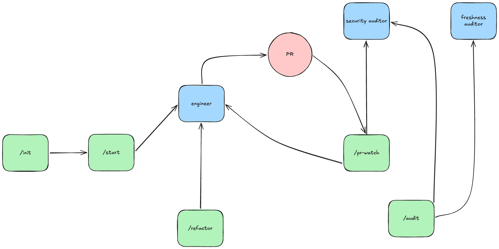
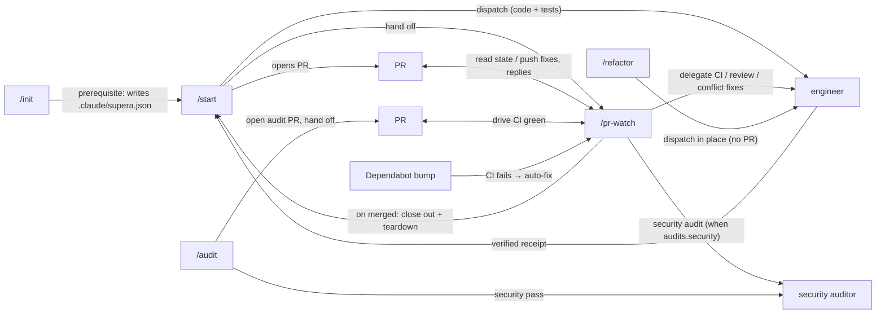

# supera


**A repo-agnostic change-shipping toolkit for [Claude Code](https://claude.com/claude-code).** One implementer agent plus a handful of orchestrator skills take a one-line task and drive it to a merged, CI-green pull request — on any GitHub repo:

> **task → worktree → implement + test → PR → babysit CI → merged → cleaned up**

**Why supera?** Shipping a change means the same chore every time: cut a branch, write the code *and* the tests, open a PR, babysit CI until it's green, resolve review threads, then clean up — and you re-learn the build/test/lint commands for every repo and stack. supera does that loop for you with one command. Everything repo-specific lives in a tiny per-repo `.claude/supera.json`, so the **same** skills work across any stack you can express as install/build/test/lint commands (pnpm, npm, yarn, cargo, Strapi, Go, Python; `stack: mixed` for polyglot repos).

supera is **git/GitHub-native: there is no external tracker.** The pull request *is* the unit of work — lifecycle, escalation, and history all live on the branch and the PR.

---

## Architecture



The precise flow — who calls whom, and who hands off to whom:



> Commands are invoked namespaced — `/supera:start`, `/supera:init`, and so on. The diagrams use the short name for readability.

**Skills orchestrate, agents implement.** The skills route lifecycle and PR mechanics and delegate every line of application code to the single implementer, `supera-engineer` (the security auditor is the implementer for `/supera:audit`). Nothing commits to base directly — every path ships via a branch/worktree and, except `/supera:refactor`, via a PR, with **CI as the gate**.

---

## Quickstart

### Before you start

- **[Claude Code](https://claude.com/claude-code)** with plugin support.
- **`gh` CLI** installed and authenticated (`gh auth login`) — supera does *all* GitHub work through it.
- A target repo that is a **git repo with a GitHub remote** (supera ships via GitHub PRs; default remote `origin`).

### 1. Install the plugin

Run these inside Claude Code, once:

```text
/plugin marketplace add heronlabs/supera
/plugin install supera@supera-marketplace
```

(`heronlabs/supera` is the GitHub repo; `supera-marketplace` is the marketplace it registers; `supera` is the plugin.) Confirm it installed by opening `/plugin`.

### 2. Set up a repo (once per repo)

In your terminal:

```bash
cd your-repo   # an existing git repo with a GitHub remote
```

Then, in Claude Code:

```text
/supera:init
```

`/supera:init` is interactive — it detects your stack and asks you to confirm the build/test/lint commands. Commit the resulting `.claude/supera.json` so the config travels with the repo.

### 3. Ship a change

```text
/supera:start "add retry on timeout"
```

This cuts a worktree, delegates the code + tests to `supera-engineer`, opens a PR, and hands off to `/supera:pr-watch` to drive CI green. It runs a full implement → test → PR → CI cycle, so it takes as long as your build and tests do — the fast part is *time to PR opened*, not merged. When the PR merges, `/supera:pr-watch` auto-hands-off to `/supera:start` to record what shipped and tear the worktree down — no manual step.

> If `/supera:start` hits an ambiguity it can't safely resolve, it posts a `🚫 supera blocked:` comment on the PR — read it, address the cause, and re-run `/supera:start <branch>`.

---

## Commands

| Command | What it does | Args |
|---|---|---|
| `/supera:init` | Bootstrap a repo: detect the stack, ground install/build/test/lint in the repo's CI (or ask when there's none), write `.claude/supera.json`, and offer Dependabot, a weekly audit cron, and the Dependabot→pr-watch auto-fix workflow. Run once per repo. | *(interactive — detect & confirm)* |
| `/supera:start` | Full-lifecycle orchestrator: task → worktree → delegate to `supera-engineer` → PR → hand off to `/pr-watch`, and tear down on a merged PR. Idempotent — re-run to resume or close out; `finish` merges a green PR then closes out. | `[task \| branch] [--non-interactive]` · `pause [branch]` · `finish [branch]` |
| `/supera:pr-watch` | PR babysitter: monitor CI, fix failures via `supera-engineer`, address review threads, run one code-review cycle (plus a security audit when enabled), exit when green, synced, and resolved. | `[PR#] [--non-interactive]` |
| `/supera:refactor` | Improve existing code in place — dispatch `supera-engineer` against a repo/dir/file. Lightweight: no worktree, no PR, no commit — leaves changes in your working tree to review. | `[path] [directive]` |
| `/supera:audit` | Standalone dependency-audit orchestrator: cut a worktree, run the security auditor (CVE overrides, action-pins), carry safe auto-fixes into a PR, hand off to `/pr-watch`. CI-cron-ready. | `[branch] [--non-interactive]` |

## Agents

| Agent | Role |
|---|---|
| `supera-engineer` | **The single implementer.** Ships a well-scoped change end-to-end in an isolated worktree: orients on the repo's own conventions, writes code **and** tests, and self-verifies (build/test/lint) before returning a structured receipt. Dispatched by `/supera:start` and `/supera:refactor`. |
| `supera-security-auditor` | Cross-ecosystem supply-chain audit (npm/pnpm/yarn/cargo) plus GitHub Actions: CVEs, missing/stale overrides, typo-squats, provenance gaps, unpinned Actions, leaked secrets. Picks the *correct* remediation per CVE (upgrade / scoped override / remove stale override / hold / flag) instead of reflexively pinning, and auto-pins unpinned Actions to their commit SHA. Report-only by default; auto-applies only bounded, gated fixes. Gated by `audits.security`. Dependency currency (routine version bumps) is owned by Dependabot, not supera. |

---

## How it works

### The lifecycle is a phase ladder — a fixed sequence supera derives fresh from git + GitHub on every run, with no state file:

```text
fresh → scaffolded → building → built → pr-open → merged
```

`/supera:start` owns the whole ladder and is **idempotent**: every run detects where the work already sits and drives the next step.

| Phase | Signal | `/supera:start` does |
|---|---|---|
| `fresh` | no branch, no worktree | cut the worktree, plan, delegate to the engineer |
| `scaffolded` | worktree exists, 0 commits | resume — delegate the full implementation |
| `building` | commits, HEAD is a `wip:` checkpoint | resume — undo the checkpoint, finish from where it stopped |
| `built` | commits, no PR | open the PR |
| `pr-open` | PR open | hand to `/supera:pr-watch` |
| `merged` | PR merged | post the shipped summary, tear down the worktree + branch |

Because the phase is read fresh from git + GitHub on every run, supera survives interruptions, machine switches, and headless CI restarts. `/supera:start pause <branch>` checkpoints mid-flight (a `wip:` commit carrying what's left); a later re-run resumes exactly where it stopped.

### The round-trip

`/supera:start` opens the PR and hands to `/supera:pr-watch`, which drives the PR green — delegating every fix back to `supera-engineer`, resolving review threads and conflicts, running one code-review cycle, and (optionally) a security audit and a merge-readiness consensus vote. It **never** closes out a merged PR itself: on merge it auto-hands-off the normal PR to `/supera:start <branch>`, which records what shipped and cleans up; for a `supera:audit` PR it announces a `/supera:audit` re-run instead of auto-invoking (since `/supera:audit` is date-scoped). `/supera:pr-watch` is the only piece living outside the ladder — `/supera:start` routes to it, never duplicates it.

### Escalation lives on the PR

supera has no tracker. When a run blocks — a CI failure that survives two fix attempts, a committed secret, an unresolvable design question — it posts a visible `🚫 supera blocked:` comment (carrying a hidden `<!-- supera:blocked -->` marker) on the PR. That comment is the escalation endpoint: durable, visible, and detected by a re-run so it doesn't re-loop an already-blocked PR.

---

## Configuration — `.claude/supera.json`

Written by `/supera:init` and safe to hand-edit. See [`schema/supera.schema.json`](schema/supera.schema.json) for the full contract. A minimal example:

```jsonc
{
  "stack": "cargo",
  "verify": {
    "install": "cargo fetch",
    "build": "cargo build --workspace",
    "test": "cargo test --workspace",
    "lint": "cargo clippy -- -D warnings"
  },
  "worktree": { "dir": ".worktrees", "base": "main" },
  "pr": { "base": "main", "remote": "origin" },
  "audits": { "security": true }
}
```

| Key | Meaning |
|---|---|
| `stack` | Primary toolchain (`pnpm`, `npm`, `yarn`, `cargo`, `strapi`, `go`, `python`, `mixed`). **Required.** |
| `verify` | Commands the engineer self-verifies with and `/supera:pr-watch` reproduces CI from: `install` / `build` / `test` / `lint` (omit any step the stack lacks). **Required.** |
| `worktree` | How `/supera:start` cuts its workspace: `dir` (default `.worktrees`), `base` (default `main`), `postCreate` (defaults to `verify.install`). |
| `pr` | PR defaults: `base` (target branch, default `main`), `remote` (default `origin`). |
| `audits.security` | `true`/`false` (default `false`). Enables `supera-security-auditor`. |
| `audits.actionPinAllowlist` | Globs of `owner/repo` whose unpinned GitHub Actions the security auditor leaves floating (default `[]` = pin everything). |
| `review.consensus` | Optional pre-merge merge-readiness vote in `/supera:pr-watch`: `voters` (default `1` = off), `quorum`. |
| `review.lenses` | Optional specialist review lenses in `/supera:pr-watch` (`silent-failures` \| `type-design` \| `test-coverage`). Default `[]`. |
| `security.denyPaths` | Globs the engineer must never touch and `/supera:pr-watch` refuses into a PR (secrets / private keys). Defaults to common secret/key globs; `[]` disables. |

---

## Dependency audits

Dependency hygiene is layered. **Dependabot** owns the mechanical, deterministic floor — routine version bumps, keeping already-pinned GitHub Actions fresh, and the security-update safety net. supera's **security auditor** owns the judgment Dependabot can't make. `/supera:init` offers to wire up Dependabot for you.

`/supera:audit` is a standalone, recurring-hygiene orchestrator, decoupled from the feature lifecycle. It runs the security auditor, folds its safe auto-fixes into a date-scoped PR (`chore-audit-<date>`), and hands off to `/pr-watch`. The auditor is **report-only by default** and only ever auto-applies bounded, gated, verified fixes — everything else is surfaced for a human to decide.

The security audit also hardens your CI supply chain: it flags every GitHub Actions `uses:` ref that isn't pinned to a commit SHA and **auto-pins tag/semver refs** (e.g. `actions/checkout@v4` → `actions/checkout@<40-hex-sha> # v4`), preserving the original ref as a trailing comment. Branch refs and unresolvable/unreachable ones are flagged, never auto-pinned.

Enable it in `.claude/supera.json` (`audits.security`), then run `/supera:audit` on demand, or schedule it in CI.

### Auto-fixing Dependabot bumps

When a Dependabot bump breaks CI, `/supera:init` can emit a `.github/workflows/supera-dependabot-pr-watch.yml` that fires on **CI completion** (`workflow_run`) for failed Dependabot PRs and runs `/supera:pr-watch --non-interactive` on the PR — so `supera-engineer` makes the code and tests work with the bumped version instead of leaving the PR red. It's offered (recommended) only when Dependabot was accepted and a CI workflow was detected. supera dogfoods it in [`.github/workflows/dependabot-pr-watch.yml`](.github/workflows/dependabot-pr-watch.yml).

### Scheduling it in CI

`/supera:init` offers to write a weekly `/supera:audit` cron into `.github/workflows/supera-audit-weekly.yml` (opt-in, only when the security auditor is enabled and the repo is GitHub-hosted). It runs the auditor via [`anthropics/claude-code-action`](https://github.com/anthropics/claude-code-action), loading supera from the public marketplace, and opens an audit PR. Add an `ANTHROPIC_API_KEY` (or `CLAUDE_CODE_OAUTH_TOKEN`) repo secret for it, and — to let the auditor push GitHub Actions SHA-pins — a `SUPERA_AUDIT_TOKEN` (a PAT/App token with `workflow` scope): the default `GITHUB_TOKEN` lacks `workflow` scope, so with only it the audit still runs and pins dependencies but cannot push `.github/workflows/*` changes. supera's own repo runs the same cron from [`.github/workflows/audit-weekly.yml`](.github/workflows/audit-weekly.yml), the canonical reference for the emitted one.

## Headless / CI

Every orchestrator accepts `--non-interactive` for headless runs (e.g. GitHub Actions via `anthropics/claude-code-action`). The pipeline is unchanged; only the prompt points differ — instead of asking a human, an ambiguous fork surfaces as a PR comment and the run exits `blocked`. A weekly `/supera:audit --non-interactive` cron is the common setup — `/supera:init` offers to emit it for you (see [Scheduling it in CI](#scheduling-it-in-ci)).

---

## Safety & permissions

supera runs `git` and `gh` under your existing `gh` authentication — its reach on GitHub equals yours. The guard rails:

- **Never commits to base.** Every change is made on a feature branch/worktree and ships via a pull request; CI is the gate. There is no direct-to-base path.
- **Self-verifies before opening a PR.** `supera-engineer` runs your build/test/lint and returns a structured receipt; red work is surfaced, not pushed.
- **Won't touch secrets.** `security.denyPaths` blocks the engineer from creating, modifying, or staging secret and private-key files, and `/supera:pr-watch` refuses them into a PR (a match is a hard merge blocker). Defaults cover common secret/key globs.
- **Headless mode is unattended.** `--non-interactive` pushes branches and opens PRs without prompting (it does **not** merge — that stays your decision). Scope the `gh` token to the repos you intend it to act on.
- **`/supera:refactor` is the exception to the PR rule** — it edits in place and leaves the changes **uncommitted** for you to review; nothing is pushed.

## Troubleshooting

| Symptom | Fix |
|---|---|
| `command not found` after install | Commands are namespaced — type `/supera:start`, not `/start`. Confirm the plugin is installed via `/plugin`. |
| GitHub / auth errors | Run `gh auth login`; all GitHub work goes through the `gh` CLI. |
| `"This repo isn't set up for supera"` | Run `/supera:init` first, and commit the `.claude/supera.json` it writes. |
| Wrong build/test/lint commands | Re-run `/supera:init`, or hand-edit `.claude/supera.json`. |
| A PR shows `🚫 supera blocked` | Read the comment, fix the cause, re-run `/supera:start <branch>` (or `/supera:audit` for an audit PR). |
| Update the plugin | `/plugin update`. |

## How it's organized

Three layers, one rule — **single source of truth**:

- **Skills orchestrate** (`/supera:init`, `/supera:start`, `/supera:pr-watch`, `/supera:refactor`, `/supera:audit`) — lifecycle, phase routing, PR mechanics. They delegate; they don't implement.
- **Agents implement** (`supera-engineer`, the security auditor) — the engineer writes code and tests; the auditor analyses and applies bounded fixes.
- **Shared guidelines are canonical** (`guidelines/`) — cross-cutting conventions (commit hygiene, auditor mechanics) live once and are referenced, never restated.

## Requirements

- **[Claude Code](https://claude.com/claude-code)** with plugin support.
- **`gh` CLI** installed and authenticated (`gh auth login`).
- **[superpowers](https://github.com/obra/superpowers)** plugin *(optional)* — when present, `supera-engineer` uses its TDD / systematic-debugging / verification skills; without it, the engineer follows the same discipline directly, minus the shared skill implementations. supera works without it; install it later if you want.

## Getting help

Questions, bugs, and feature requests → [GitHub Issues](https://github.com/heronlabs/supera/issues). For anything security-sensitive (supera runs `git`/`gh` on your behalf), please report it privately via the repository's security advisories rather than a public issue.

## Contributing

Contributions welcome — see [CONTRIBUTING.md](CONTRIBUTING.md). In short: this repo *is* a Claude Code plugin, so editing it changes behaviour everywhere supera is installed. Versioning is automated — CD bumps, tags, and releases on merge to `main`, so don't hand-bump `version`; just keep `schema/supera.schema.json` in sync with what the skills read.

## License

[MIT](LICENSE) © Lucas Lacerda
